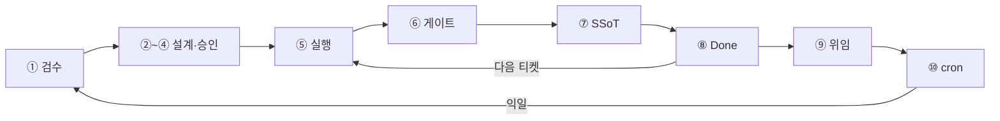
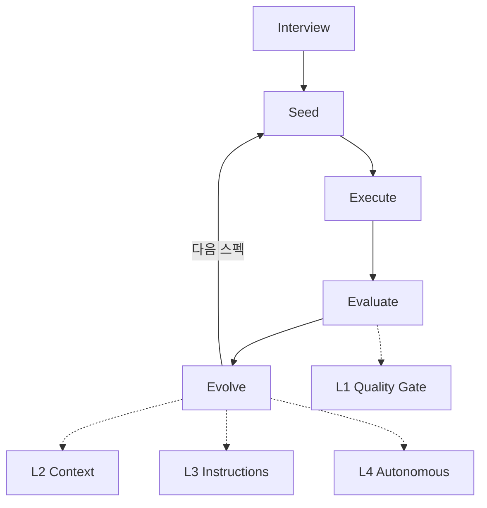

### TL;DR

* Cursor·Claude Code만 쓰면 **세션 끝 = 맥락 소멸**이 반복된다. E2E 워크플로우는 하루 단위로 사람·에이전트·기록·스케줄이 맞물리는 **24시간 순환 루프**다.
* 중심에는 Git 기반 **SSoT(Single Source of Truth)** 가 있고, Harness의 **Ouroboros 패턴**으로 품질·맥락·규칙이 진화한다.
* Hermes cron으로 아침 브리핑·야간 리뷰를 자동화하면, 익일 출근 시 ①단계로 자연스럽게 복귀한다.
* 개인 프로젝트에서도 티켓·SSoT·스킬·cron만 맞추면 "채팅만 하는 AI"에서 "기억하는 팀원"으로 바뀐다.

----
### 들어가며

AI 코딩 도구를 쓰다 보면 이런 경험이 익숙합니다. 어제 에이전트와 길게 설계 논의했는데, 오늘 새 세션을 열면 **"그게 뭐였더라?"** 상태로 돌아가는 것. 코드는 남아도 **왜 그렇게 결정했는지, 어떤 가정을 깔았는지**는 채팅 로그 안에 묻혀 버리죠.

저도 Cursor·Claude Code·Hermes를 개인 프로젝트에 붙여 쓰면서, "도구는 강한데 맥락이 안 이어진다"는 문제를 계속 느꼈습니다. 그래서 정리한 게 **E2E(End-to-End) AI 워크플로우**와 **Ouroboros 패턴**입니다. 채팅 한 판이 아니라, **하루·한 주 단위로 돌아가는 루프**로 생각하는 거죠.

----
### E2E 10단계 루프 — 하루 1회 순환

E2E 루프는 출근부터 야간 cron까지 **10단계**로 한 바퀴 돕니다.

| 단계 | 이름 | 주체 | 요약 |
|------|------|------|------|
| ① | 검수 | HUMAN | 아침 브리핑·전날 야간 산출물 확인, 티켓·알림 검토 |
| ② | Skill 파악 | AGENT+HUMAN | 신규 업무 시 brainstorming, Human이 방향 제시 |
| ③ | 설계 | HUMAN+AGENT | 인수기준·SSoT 참고, Human 확정·Agent 초안 |
| ④ | 승인 | HUMAN | 계획·민감 작업 Human OK 후 진행 |
| ⑤ | 실행 | AGENT | 티켓 구현, MCP·Harness Skill. 기존 티켓이면 ②~④ 생략 가능 |
| ⑥ | 게이트 | AGENT | lint, test, ponytail-review 등 Harness Skill로 자동 검증 |
| ⑦ | SSoT | AGENT | adr, docs, context commit으로 맥락 기록 |
| ⑧ | Done | HUMAN | 티켓 완료·SSoT 링크. 다음 티켓이면 ⑤부터 반복 |
| ⑨ | 위임 | AGENT | 퇴근 시 Hermes batch job 등록·실행, 야간 작업 트리거 |
| ⑩ | cron | AGENT | 아침 work-briefing, 저녁 eod-review → 익일 ①로 복귀 |

**페이즈**로 보면: 출근(①) → 업무(②~⑧) → 퇴근(⑨) → 야간/cron(⑩) → 익일 ①.



핵심은 **⑤~⑧을 티켓 단위로 반복**하고, **⑨⑩에서 맥락을 밖으로 밀어 넣는다**는 점입니다. 에이전트 세션이 끊겨도 SSoT와 cron이 이어 주니까요.

----
### 아키텍처 4계층 + SSoT 횡단

도구를 층으로 나누면 역할이 분명해집니다.

1. **LLM Model** — 추론·코드 생성 엔진 (Claude, GPT, Gemini, Composer 등)
2. **LLM Agent** — Cursor, Claude Code 등. 모델+도구+세션으로 실행
3. **LLM Orchestration** — Hermes gateway, cron, job으로 여러 Agent·하루 루프 조율
4. **Harness** — instructions, Skills, Ouroboros로 "어떻게 일할지" 통일
5. **SSoT (횡단)** — Git의 adr, docs, context, Skills 레시피. 시작 시 읽고(①②), 완료 시 씀(⑦)

**보완 관계**를 한 줄로 정리하면:

* Model + Agent = 채팅이 아니라 티켓·코드·SSoT까지 연결
* Agent + Orchestration = 한 세션이 아니라 E2E 루프 유지
* Orchestration + Harness = 언제·무엇 + 어떻게 = 품질·방식 통일
* Harness + Human = 자동 검증 + Human 승인·배포 = 안전 게이트
* SSoT ↔ 전 계층 = 개인(또는 팀) 기억 공유

SSoT는 "문서 폴더 하나 더"가 아닙니다. **에이전트가 매 세션 시작할 때 읽고, 작업 끝날 때 쓰는 단일 진실 공급원**이어야 루프가 닫힙니다.

----
### Ouroboros 5단계와 L1~L4 매핑

Harness 쪽에는 **Ouroboros 패턴** — 뱀가리처럼 꼬리를 물고 도는 5단계 루프 — 가 있습니다.

1. **Interview** — 맥락 수렴, 숨은 가정·요구 파악 → `brainstorming` Skill
2. **Seed** — 스펙 고정, Seed Spec 저장 → `writing-plans` + SSoT(adr/spec)
3. **Execute** — 스펙 기반 구현 → LLM Agent (Cursor, Claude Code)
4. **Evaluate** — 품질 검증, Quality Gate → **L1~L4로 심화**
5. **Evolve** — 피드백 루프, 평가 결과→다음 Seed → **L1~L4로 심화**

Evolve에서 나온 교훈이 다시 Seed로 돌아가 **다음 세대 스펙**을 업데이트합니다. "한 번 하고 끝"이 아니라 **진화하는 스펙**이죠.

#### L1~L4 Harness 루프 (Evaluate + Evolve 심화)

| 레벨 | 이름 | 내용 |
|------|------|------|
| L1 | 검증 루프 (Quality Gate) | lint·test·인수기준·ponytail-review. 실패 시 완료 차단 |
| L2 | 회고 주입 (Context Loop) | collect-history → inject-history → context.md 자동 주입 |
| L3 | 메타 학습 (Instructions Loop) | /reflect → instructions·agents 개선. **Human 승인 필수** |
| L4 | 자율 진화 (Autonomous) | Hermes GEPA·SKILL.md 자율 생성. L3과 달리 자동 반영 가능 |

E2E 10단계와 매핑하면 대략 이렇습니다.

* ②③ → Interview + Seed
* ⑤ → Execute
* ⑥ → Evaluate (L1)
* ⑦ → SSoT 기록 + L2 회고 주입
* ⑨⑩ + L3/L4 → Evolve (규칙·스킬 개선)



----
### Hermes·cron·Skills가 루프에서 맡는 역할

개인 프로젝트에서 제가 쓰는 조합은 대략 이렇습니다.

| 도구 | 역할 | 시점 |
|------|------|------|
| 티켓·승인 | 태스크 관리, Human 승인 게이트 | 출근, 완료 |
| LLM Agent | IDE/CLI 코드 편집, MCP | 업무 실행(⑤) |
| Hermes | gateway, Skills, cron | 퇴근 job(⑨), 아침·저녁 cron(⑩) |
| Git SSoT | adr, docs, skills, 맥락 기록 | 업무 완료 후 누적(⑦) |
| Skills | brainstorming, ponytail, e2e 등 레시피 | 단계별 호출 |

**Hermes cron** 예시는 이런 식입니다. (실제 채널 ID·내부 이름은 빼고 일반화했습니다.)

```bash
# 아침 08:00 — 전날 야간 산출물·오늘 할 일 브리핑 (E2E ① 보조)
hermes cron create \
  --name "daily-work-briefing" \
  --schedule "0 8 * * *" \
  --workdir ~/my-project \
  --prompt "SSoT와 어제 커밋 기준 오늘 브리핑"

# 저녁 22:00 — 하루 회고·맥락 정리 (⑦⑧ 보조)
hermes cron create \
  --name "daily-eod-review" \
  --schedule "0 22 * * *" \
  --workdir ~/my-project \
  --prompt "오늘 완료 티켓·SSoT diff 요약"
```

`workdir`을 git repo로 두면 `AGENTS.md`가 컨텍스트에 들어가서, **프로젝트 규칙을 아는 에이전트**가 ⑩에서 돌아갑니다. 익일 ① 검수 때 사람이 브리핑만 훑으면 루프가 닫힙니다.

Skills는 ②⑥ 단계의 **레시피**입니다. 매번 "lint 돌리고 실패하면 고쳐"를 프롬프트에 쓰지 않고, `ponytail-review` 같은 스킬을 호출하면 Harness가 통일된 품질 게이트를 제공합니다.

----
### 마치며 — 개인 프로젝트에 적용할 때

처음부터 10단계·L4까지 다 넣을 필요는 없습니다. 제 경험상 효과가 큰 것만 꼽으면 세 가지입니다.

1. **SSoT부터** — `docs/`, `adr/`, `context.md` 중 하나라도 Git에 고정. ⑦ 없으면 ①이 항상 빈손입니다.
2. **cron 2개** — 아침 브리핑 + 저녁 회고만 있어도 ⑨⑩이 돌아가기 시작합니다. [Hermes Agent 소개 글](/2026/07/01/hermes-agent-intro.html)의 cron 설정을 참고하면 됩니다.
3. **L1 게이트** — 완료 전 lint/test 한 번. Ouroboros Evaluate가 형식만 갖춰져도 "대충 끝낸 티켓"이 줄어듭니다.

채팅만 하면 맥락이 사라지는 건 도구 탓이 아닙니다. **루프가 없어서** 그렇습니다. E2E + Ouroboros + SSoT를 얹으면, 에이전트가 세션마다 초기화돼도 **Git과 cron이 기억**해 줍니다.

다음 글에서는 AI 코딩 에이전트(Cursor, Claude Code, Copilot) 비교를 이어서 정리할 예정입니다.
