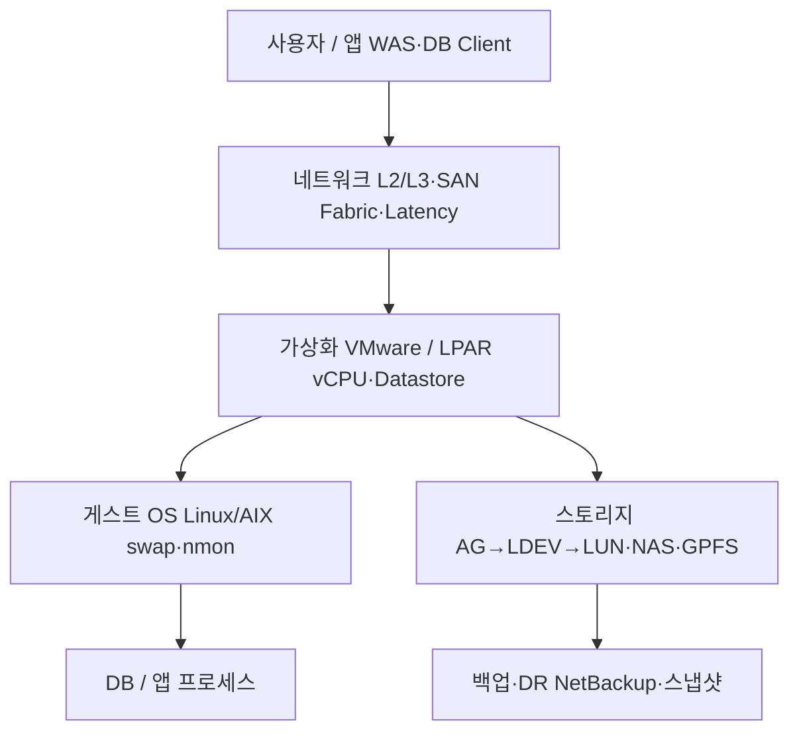

### TL;DR

* VM·앱만 보면 장애 원인을 놓칩니다. 온프레미스는 **사용자 → 네트워크 → 가상화 → OS → 스토리지 → 백업** 순으로 아래층이 위를 받칩니다.
* 스토리지 핵심은 **AG(디스크 풀) → LDEV/LUN(호스트에 붙는 논리 디스크)** 계층입니다.
* NAS/NFS는 파일 공유, SAN Fabric는 FC 스위치·존으로 블록 스토리지를 연결합니다.
* **Write Latency·I/O wait** 숫자는 절대값보다 **변화량(Δ)** 이 중요합니다.
* 1주차 학습은 [인프라 생존기](https://infra-survival.tistory.com/) 56~58편부터 시작하면 됩니다.

----
### 들어가며

클라우드만 쓰다가 온프레미스 환경을 접하면 처음엔 VMware 콘솔이나 VM 목록만 보게 됩니다. "서버 몇 대, vCPU 몇 개"로 이해하면 장애 때 **스토리지·SAN·백업** 쪽 원인을 놓치기 쉽습니다.

저도 개인 학습 차원에서 [인프라 생존기 : 무너진 성벽의 기록](https://infra-survival.tistory.com/) 블로그를 읽으며, 용어와 계층 구조를 정리하기 시작했습니다. 현장 경험이 없어도 **"VM 아래에 뭐가 있는지"** 말할 수 있게 만드는 게 1편 목표입니다.

----
### 온프레미스 계층 구조

위에서 아래로 **의존**합니다. 위층(VM·앱)만 보면 안 되고, 아래층이 흔들리면 위도 같이 흔들립니다.



ASCII로 보면 이렇습니다.

```
[ 사용자 / 앱 (WAS, DB Client) ]
           │
    ┌──────┴──────┐
    │  네트워크    │  L2/L3, SAN Fabric, Latency
    └──────┬──────┘
           │
    ┌──────┴──────────────────────────┐
    │  가상화 (VMware / LPAR)          │
    │  ┌─────────────────────────┐    │
    │  │  게스트 OS               │    │
    │  │  ┌───────────────────┐  │    │
    │  │  │  DB / 앱 프로세스  │  │    │
    │  │  └───────────────────┘  │    │
    │  └─────────────────────────┘    │
    └──────┬──────────────────────────┘
           │
    ┌──────┴──────┐
    │  스토리지    │  AG → LDEV → LUN, NAS/NFS, GPFS
    └──────┬──────┘
           │
    ┌──────┴──────┐
    │  백업·DR     │  NetBackup, 스냅샷 ≠ 백업
    └─────────────┘
```

**핵심:** "VM이 느리다"고 OS만 보면 끝이 아닙니다. Datastore 아래 **AG·LUN·SAN**까지 내려가야 합니다.

----
### 스토리지·NAS·SAN 핵심 용어

| 용어 | 한 줄 정의 |
|------|------------|
| **AG (Array Group)** | 디스크 풀·용량·성능을 묶는 **스토리지 논리 단위** |
| **LDEV / LUN** | 호스트(OS)에 붙는 **블록 스토리지 논리 디스크** |
| **SAN Fabric** | 스토리지↔서버를 잇는 **FC SAN 스위치·존** |
| **NAS / NFS** | 파일 공유. **Latency·마운트 옵션**이 성능 좌우 |
| **GPFS / Fileset / Quota** | 대용량 파일시스템. **논리 한도 ≠ 물리 용량** |
| **Write Latency** | 쓰기 지연(ms). 절대값이 작아도 **Δ 100배**면 장애 신호 |
| **I/O wait** | CPU가 디스크 I/O를 기다리는 %. **스토리지 병목 vs CPU** 구분 |

AG → LDEV → LUN 흐름을 이해하면 "VM 디스크가 어디에 물려 있는지"가 보입니다. VMware의 **Datastore**는 이 LUN 위에 올라가는 공유 스토리지이고, 80% 임계 같은 운영 기준이 붙는 계층이죠.

NAS는 블록이 아니라 **파일 공유**입니다. 마운트 옵션 하나로 Latency가 크게 달라질 수 있어서, "스토리지 탓"이라고 말하기 전에 **네트워크·마운트 설정**부터 확인하는 습관이 필요합니다.

----
### 1주차 학습 로드맵

현장에 가지 않고 읽기만으로 **계층 감각**을 잡는 1주차 순서입니다.

| 읽을 글 | 주제 | 목표 |
|---------|------|------|
| [56편](https://infra-survival.tistory.com/56) | AG가 뭔지 | 스토리지 **논리 단위** 이해 |
| [57편](https://infra-survival.tistory.com/57) | VM만 해봤다 | AG → LDEV → VM **계층** |
| [58편](https://infra-survival.tistory.com/58) | NetBackup | **백업·복구** 계층 |

세 편을 다 읽고 나면 "VM 아래에 뭐가 있는지" 한 문장으로 말할 수 있어야 합니다. 58편에서 **스냅샷 ≠ 백업**, 복구 경로 혼동 같은 운영 착각도 같이 잡힙니다.

----
### 자주 하는 착각

| 패턴 | 예시 | 대응 |
|------|------|------|
| **레이어 무시** | VM만 알고 AG·LUN 모름 | 구조도부터 |
| **절대값 착각** | Latency 숫자 작으니 OK | **변화량(Δ)** 보기 |
| **용어 혼동** | quota=용량 | 용어表로 정리 |
| **팩트 vs 감** | "스토리지 탓" | I/O wait·로그로 확인 |

인프라는 정직합니다. **로그와 숫자**는 거짓말하지 않는다는 말이 생존기에서 반복되는 이유가 여기 있습니다.

----
### 마치며

1편에서는 **계층 구조**와 **스토리지·NAS·SAN** 용어만 잡았습니다. VM 콘솔이 익숙해도 AG·LUN·SAN Fabric을 모르면 장애 대응에서 한 층이 비어 있습니다.

다음 2편에서는 **가상화(VMware/LPAR)·OS 성능 도구·네트워크 Latency**를 이어서 정리할 예정입니다. 1주차 로드맵(56~58)부터 읽어 보시면 이 시리즈와 잘 맞습니다.