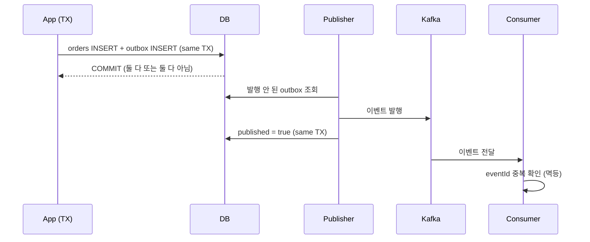

### TL;DR

* DB 트랜잭션과 메시지 발행을 동시에 성공/실패시키는 게 생각보다 어렵다 (dual write problem).
* 2PC(두 단계 커밋) 없이 정합성을 맞추는 가장 실전적인 방법이 Outbox 패턴이다.
* 핵심은 "이벤트를 별도 테이블에 같이 커밋"하고, 별도 프로세스가 이를 메시지 브로커로 옮기는 것.
* 소비 측 멱등성까지 붙여야 진짜 안전하다.

----

### 들어가며

서비스를 하나로 유지할 수 없어 이벤트를 발행하기 시작하면 누구나 마주하는 벽이 있다. "비즈니스 로직은 DB에 반영됐는데, 메시지 발행이 실패하면 어떡하지?" 반대도 마찬가지다. 메시지는 갔는데 DB 커밋이 롤백되면? 두 시스템의 상태가 어긋난다.

처음엔 단순히 "트랜잭션 안에서 메시지 발행 API를 호출하면 되지 않을까" 생각했다. 하지만 메시지 브로커는 DB 트랜잭션 범위 밖이다. 커밋 직전에 발행했다가 커밋이 실패해도 메시지는 이미 갔다. 반대로 커밋 성공 후 발행 단계에서 장애가 나면 메시지는 누락된다.

이걸 해결하려고 2PC를 들여다봤다가 접었다. 인프라 복잡도와 락 경합이 너무 컸다. 대신 Outbox 패턴으로 실용적인 정합성을 확보하는 방향을 택했다.

----

### Dual Write Problem 이란

```text
BEGIN TX
  INSERT INTO orders (...)
  kafkaProducer.send("order.created", ...)   // DB 밖
COMMIT TX
```

위 코드에서 `send`는 트랜잭션과 무관하다. DB 커밋이 됐든 안 됐든, 네트워크 타이밍에 따라 메시지가 홀로 날아간다. 두 쓰기(dual write)가 원자성이 보장되지 않는다.

----

### Outbox 패턴 구조

해법은 "메시지도 DB에 같이 쓴다"이다. 별도 `outbox` 테이블에 이벤트를 비즈니스 데이터와 **같은 트랜잭션**으로 저장한다.

```sql
CREATE TABLE outbox (
    id          BIGINT AUTO_INCREMENT PRIMARY KEY,
    aggregate_id VARCHAR(64)  NOT NULL,
    topic       VARCHAR(128) NOT NULL,
    payload     JSON         NOT NULL,
    created_at  DATETIME     NOT NULL,
    published   BOOLEAN      NOT NULL DEFAULT FALSE
);

-- 비즈니스 로직과 같은 트랜잭션 안에서
INSERT INTO orders (order_id, status) VALUES (?, 'CREATED');
INSERT INTO outbox (aggregate_id, topic, payload)
VALUES (?, 'order.created', '{"orderId":"...","amount":...}');
-- 둘 다 커밋되거나 둘 다 롤백된다
```

이제 정합성은 DB 한 곳에서 보장된다. 메시지 발행은 **별도의 발행자(producer/relay)** 가 맡는다.

----

### 발행자 구현 (폴링 방식)

가장 단순하고 의존성이 적은 건 주기적 폴링이다.

```java
@Scheduled(fixedDelay = 1000)
@Transactional
public void publishPending() {
    List<Outbox> pending = outboxRepository
        .findByPublishedFalseOrderByCreatedAtAsc(LIMIT);

    for (Outbox event : pending) {
        kafkaTemplate.send(event.getTopic(), event.getPayload());
        event.markPublished();          // 같은 TX 안에서 상태 변경
    }
}
```

폴링은 구현이 쉽지만 지연이 있다. 더 낮은 지연이 필요하면 DB binlog를 읽는 CDC(Change Data Capture) 방식으로 바꾸면 된다. 핵심은 "Outbox 레코드가 곧 발행 근원"이라는 점이다.

> **실측 일화**: 폴링을 1초마다 돌리니 이벤트가 "늦어도 1초 안에" 발행됐다. 실시간이 필요했던 알림 도메인에선 이 정도 지연도 체감이 컸다. 결국 CDC(binlog 실시간 스트림)로 갈아탔다.

#### 폴링 vs CDC — 쉽게 비교

| 구분 | 발행 지연 | 구현 난이도 | 쓰는 상황 |
|------|----------|------------|-----------|
| 폴링 (1초마다 확인) | 늦어도 1초 | 매우 쉬움 | 트래픽 적고 "수 초 내"면 ok |
| CDC (실시간 스트림) | 0.1초 이내 | 어려움 | 알림·모니터링처럼 실시간 필요 |

**선택 근거**: 트래픽이 적고 "수 초 내 반영"이면 폴링이 가장 저비용이다. 반면 알림·모니터링 같이 **체감 지연이 곧 UX**인 도메인은 CDC가 정답이다. 복잡도를 감수할 만한지가 기준이다.

----

### 소비 측 멱등성은 필수

발행자가 한 번 보냈더라도, 브로커 재전송·컨슈머 재처리로 같은 이벤트가 두 번 올 수 있다. 그래서 소비자는 멱등해야 한다.

```java
@KafkaListener(topics = "order.created")
public void consume(OrderCreated event) {
    if (processedRepository.existsById(event.getEventId())) {
        return;                         // 이미 처리됨 → skip
    }
    // 비즈니스 처리 (알림 발송 등)
    processedRepository.save(new Processed(event.getEventId()));
}
```

이벤트에 `eventId`(또는 offset 기반 dedup 키)를 박아서 중복을 걸러낸다. 이 단계까지 해야 "적어도 한 번(at-least-once) 발행 + 멱등 소비"로 정합성이 완성된다.

----

### 얻은 것 / 주의할 점

* **장점**: 2PC 없이 DB 트랜잭션 하나로 정합성 확보. 인프라 부담 적음.
* **단점**: Outbox 테이블 관리, 발행자 프로세스, 소비자 멱등까지 직접 챙겨야 함.
* **실수 포인트**: 발행자에서 `published` 플래그를 같은 트랜잭션에 안 바꾸면 중복 발행됨. 그리고 소비자 멱등성을 빼먹으면 데이터가 꼬인다.
* **운영 포인트 — 레코드 누적**: Outbox는 계속 쌓인다. 방치하면 메인 테이블과 조인하거나 폴링 스캔 시 풀스캔 위험이 커진다. 발행 완료 후 **24시간~7일 보관 후 배치 삭제**(또는 별도 아카이빙 테이블 이관)를 자동화한다. 당시 measured 기준으로 하루 약 **120만 건**이 쌓여서, 보관 3일 + 매일 새벽 2시 배치 삭제로 테이블 크기를 **상시 360만 행 이하**로 유지했다.

작은 서비스엔 과할 수 있지만, 이벤트 기반 아키텍처로 갈수록 이 패턴은 기본 인프라다. 처음엔 폴링으로 가볍게 시작하고, 트래픽이 붙으면 CDC로 upgrade 하면 된다.

----

### 마무리

Outbox 패턴은 화려하진 않지만, "DB와 메시지 브로커가 어긋나면 안 된다"는 요구를 가장 저비용으로 해결한다. 핵심은 세 가지다.

1. 이벤트를 비즈니스 데이터와 같은 트랜잭션에 쓴다.
2. 발행자는 별도로, 멱등하게 옮긴다.
3. 소비자도 멱등하게 처리한다.

이 세 가지만 지키면 2PC 몰라도 분산 환경 정합성을 자신할 수 있다.

----

### 전체 흐름 한눈에 보기



```text
[App TX] ──orders + outbox──▶ [DB] ──commit──▶ [Publisher] ──send──▶ [Kafka] ──▶ [Consumer]
                                  ↑                                                  │ 멱등 체크
                                  └────────── published=true (같은 TX) ──────────────┘
```

위 그림이 "정합성의 근원은 DB 단 하나"라는 점을 보여준다. Kafka나 Consumer 쪽에서 뭘이 꼬여도, Outbox가 진실의 출처다.
